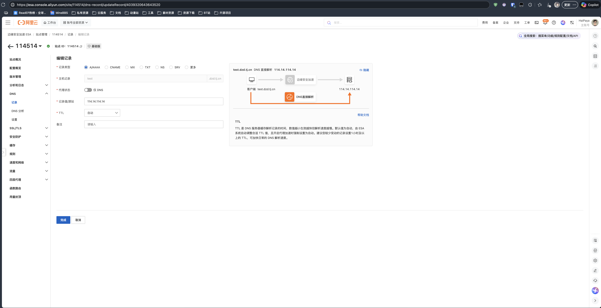

<div align="center">
    <h1>ESADDNS</h1>
    <p>基于阿里云 ESA 的 DDNS 动态域名更新工具，让您的家庭服务更快、更安全！</p>
    
    
    <br><br>
</div>

---
✨ 添加功能
 - 支持同时更新多个域名
 - 使用docker容器化部署，方便部署和管理

✨ 使用方法
 - 配置文件 `Config.jsonc` 中添加您的域名和记录 ID
 - 执行 `docker-compose up -d` 编排和启动容器

---
## 以下是原仓库项目介绍

## 📖 简介

ESADDNS 是一个基于 [Deno](https://deno.com/) 构建的 DDNS（动态域名系统）客户端，专为阿里云 ESA 服务设计。它能够自动检测您的公网 IP 地址变化，并实时更新 ESA 中的 DNS 记录。

### ✨ 特性

- 🚀 **基于 Deno** - 使用最新的 Deno 运行时，安全且易于部署
- 💪 **双栈支持** - 同时支持 IPv4 和 IPv6 网络环境
- ⚙️ **多域名管理** - 支持同时更新多个 DNS 记录
- 📝 **简洁配置** - 使用带注释的 JSONC 配置文件，易于理解和维护
- 🔁 **自动轮询** - 按设定的时间间隔自动检查和更新记录
- 🎨 **彩色日志** - 提供详细的运行日志，便于监控和故障排查

## 🔄 工作原理

1. 读取配置文件
2. 根据配置文件设定的`时间间隔`循环获取`当前设备互联网出口 IP`
3. 如`当前设备互联网出口 IP`和配置文件中的`TTL`与`ESA`中记录不一致，则自动更新`ESA`记录参数

## 🚀 快速开始

### 准备工作

1. **阿里云账号和域名**
   - 您需要拥有一个阿里云账号
   - 在 ESA 服务中添加并管理您的域名

2. **获取访问密钥**
   - 创建一个 RAM 用户并获取 `AccessKeyID` 和 `AccessKeySecret`
   - 为该用户分配适当的权限（参见[权限配置](#权限配置)部分）

3. **下载程序**
   - 前往 [Releases](https://gitee.com/HaiPaya/esaddns/releases/latest) 页面
   - 下载适用于您操作系统的最新版本可执行文件

### 获取记录ID (RecordId)

要获取记录 ID，请按照以下步骤操作：

1. 打开您需要添加到 DDNS 列表的 ESA DNS 记录配置页面：
   

2. 查看浏览器地址栏中的 URL，格式如下：
   ```
   https://esa.console.aliyun.com/site/114514/dns-record/updateRecord/4039320643643520
   ```

3. URL 末尾的数字 `4039320643643520` 就是该记录的 `RecordId`

### 配置说明

首次运行程序时会自动生成配置文件 `Config.jsonc`，包含以下字段：

| 字段 | 类型 | 描述 |
|------|------|------|
| `Auth.AccessKeyId` | string | 阿里云 RAM 用户的 AccessKey ID |
| `Auth.AccessKeySecret` | string | 阿里云 RAM 用户的 AccessKey Secret |
| `Cycle` | number | 执行周期（分钟）|
| `DDNSRecords` | array | 动态域名记录列表 |

#### DDNSRecords 数组元素说明

| 字段 | 类型 | 描述                       |
|------|------|--------------------------|
| `RecordId` | number | DNS 记录 ID                |
| `IpVersion` | number (4 或 6) | IP 版本                    |
| `TTL` | number | DNS 记录的 TTL 值（设为 1 即为自动） |

### 权限配置

有两种方式为 RAM 用户授权：

1. **推荐方式：使用系统策略**
   直接为 RAM 用户附加系统策略 `AliyunESAFullAccess`

2. **最小权限方式：自定义策略**
   如果希望遵循最小权限原则，可以创建自定义策略，包含以下权限：
   ```json
   {
        "Version": "1",
        "Statement": [
            {
                "Effect": "Allow",
                "Action": [
                    "esa:UpdateRecord",
                    "esa:GetRecord"
                ],
                "Resource": "*"
            }
        ]
   }
   ```

程序正常运行需要以下操作权限:
- `esa:UpdateRecord` - 更新 DNS 记录
- `esa:GetRecord` - 获取 DNS 记录详情

## 结尾

ESADDNS 是一个简单而强大的 DDNS 解决方案，专为阿里云 ESA 服务打造。通过自动化更新您的动态 IP 地址到 DNS 记录，您可以轻松地从外部网络访问您的家庭服务器或其他设备，而无需担心 IP 地址变更带来的问题。

### 社区和支持

如果您在使用过程中遇到任何问题或有任何建议，欢迎：

- 提交 [Issues](https://gitee.com/HaiPaya/esaddns/issues) 报告 Bug 或提出功能需求
- 参与 [Pull Requests](https://gitee.com/HaiPaya/esaddns/pulls) 贡献代码

### 许可证

本项目采用 GPL-3.0 许可证。详情请参阅 [LICENSE](./LICENSE) 文件。
